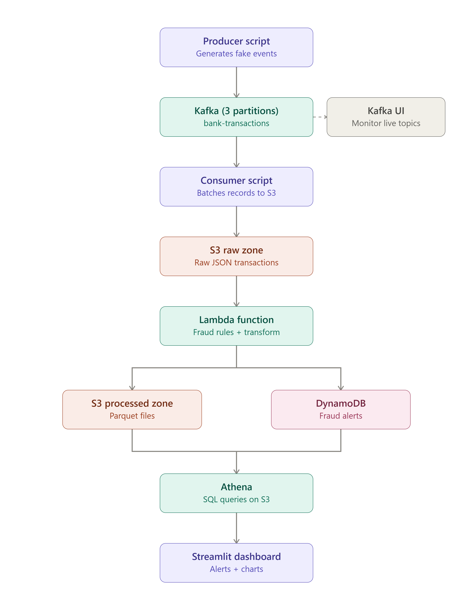
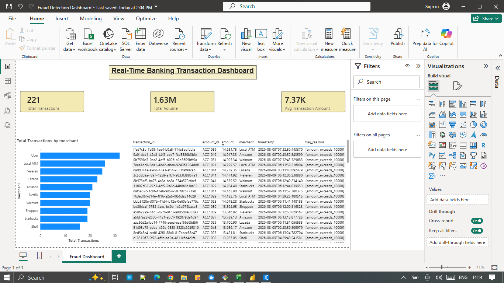

# Real-Time Banking Transaction Pipeline

A self-initiated data engineering project simulating a bank's real-time transaction stream — built with Apache Kafka, AWS (S3, Lambda, DynamoDB, Athena), and Power BI. This project was built end-to-end on AWS's free tier, at zero cost.

## Table of Contents
- [Overview](#overview)
- [Architecture](#architecture)
- [Tech Stack](#tech-stack)
- [Project Structure](#project-structure)
- [How It Works](#how-it-works)
- [Setup & How to Run](#setup--how-to-run)
- [Sample Queries](#sample-queries)
- [Dashboard](#dashboard)
- [Challenges & Fixes](#challenges--fixes)
- [Future Improvements](#future-improvements)
- [What I Learned](#what-i-learned)

## Overview

Real banking systems generate a constant stream of transaction events — deposits, withdrawals, transfers, card payments — that need to be ingested, monitored for fraud in real time, and made available for analysis. This project simulates that end-to-end, from a live event source through to a queryable data lake and an interactive dashboard.

Since real banking data isn't available for a personal project, a Python producer using `Faker` simulates the event source, standing in for what would be a bank's core systems (or a CDC tool like Debezium) in production.

## Architecture



| Component | Role |
|---|---|
| **Producer** | Simulates the bank — generates fake transactions, publishes to Kafka, keyed by `account_id` |
| **Kafka (3 partitions)** | Durable streaming backbone; decouples producer from consumers; partitioned by `account_id` for per-account ordering |
| **Kafka UI** | Web dashboard to inspect topics, partitions, and live messages |
| **Consumer** | Reads events from Kafka, batches them (10 messages or 30 seconds, whichever first), writes to S3 |
| **S3 Raw Zone** | Landing zone for raw JSON transaction data, Hive-style partitioned (`year=/month=/day=`) |
| **AWS Lambda** | Triggered automatically on new S3 files — applies fraud rules, writes alerts + transforms data |
| **DynamoDB** | Stores flagged fraud alerts |
| **S3 Processed Zone** | Cleaned, transformed transaction data (JSON) |
| **Athena** | Serverless SQL queries directly over the processed S3 data |
| **Power BI** | Live dashboard connected to Athena via ODBC — summary metrics, merchant breakdown, fraud alerts table |

## Tech Stack

- **Streaming:** Apache Kafka (Docker, Confluent images), Kafka UI
- **Language:** Python (producer, consumer, Lambda)
- **AWS:** S3, Lambda, DynamoDB, Athena, IAM
- **Dashboard:** Power BI Desktop (via Athena ODBC driver)
- **Infra:** Docker Compose, AWS CLI, AWS Console
- **Version control:** Git / GitHub

## Project Structure

```
banking-streaming-pipeline/
├── producer/
│   └── producer.py          # Generates fake transactions, publishes to Kafka
├── consumer/
│   └── consumer.py          # Reads from Kafka, batches, writes to S3
├── lambda/
│   ├── lambda_function.py   # Fraud detection + transform, triggered by S3
│   └── trust-policy.json    # IAM trust policy for the Lambda execution role
├── dashboard/
│   └── banking-dashboard.pbix  # Power BI dashboard file
├── docs/
│   └── images/               # Architecture diagram, dashboard screenshot
├── docker-compose.yml         # Kafka + Zookeeper + Kafka UI
├── requirements.txt
└── README.md
```

## How It Works

1. **`producer.py`** runs continuously, inventing a new fake transaction every 0.5-2 seconds and publishing it to the Kafka topic `bank-transactions`, keyed by `account_id` so each account's history stays ordered within a single partition.
2. **`consumer.py`** continuously reads from Kafka (as part of consumer group `s3-writer-group`, so it tracks exactly how far it's read and can resume safely if stopped), batches messages, and writes them as JSON files to `s3://.../raw/year=.../month=.../day=.../`.
3. Every new file landing in `raw/` automatically triggers **`lambda_function.py`** via an S3 event notification. The function:
   - Reads the file
   - Flags transactions where `amount > 10000`, or where an account has 3+ transactions within that batch
   - Writes flagged transactions to the **`fraud-alerts`** DynamoDB table
   - Writes all transactions (transformed) to `s3://.../processed/...`
4. **Athena** has an external table (`banking_pipeline.transactions`) defined over the processed S3 data, queryable directly via SQL — no data movement, no server to manage.
5. **Power BI** connects live to Athena via an ODBC driver, displaying summary metrics, a merchant breakdown chart, and a table of flagged transactions.

## Setup & How to Run

**Prerequisites:** Docker Desktop, Python 3.10+, AWS CLI configured with an IAM user (not root), Power BI Desktop (optional, for the dashboard).

```bash
# 1. Start Kafka, Zookeeper, and Kafka UI
docker compose up -d

# 2. Create the Kafka topic (first run only)
docker exec -it <kafka_container_name> kafka-topics --create \
  --topic bank-transactions --bootstrap-server localhost:9092 \
  --partitions 3 --replication-factor 1

# 3. Set up Python environment
python3 -m venv venv
source venv/Scripts/activate   # Windows Git Bash
pip install -r requirements.txt

# 4. Run the producer and consumer (two separate terminals)
python producer/producer.py
python consumer/consumer.py
```

AWS-side resources (S3 buckets, DynamoDB table, Lambda function, IAM role, Athena database/table) are provisioned manually via the AWS Console — see the Challenges & Fixes section below for the reasoning behind several configuration choices.

## Sample Queries

```sql
-- Total volume and transaction count
SELECT COUNT(*) AS total_transactions,
       ROUND(SUM(amount), 2) AS total_volume,
       ROUND(AVG(amount), 2) AS avg_transaction_amount
FROM banking_pipeline.transactions;

-- All flagged transactions
SELECT transaction_id, account_id, amount, merchant, timestamp, flag_reasons
FROM banking_pipeline.transactions
WHERE cardinality(flag_reasons) > 0
ORDER BY timestamp DESC;
```

## Dashboard



Built in Power BI Desktop, connected live to Athena via the AWS-provided ODBC driver. Shows total transactions, total volume, average transaction amount, a merchant breakdown chart, and a table of flagged transactions.

## Challenges & Fixes

Real debugging encountered while building this — documented because working through these is most of what was actually learned.

### 1. DynamoDB rejects Python floats
**Problem:** `table.put_item()` failed with `TypeError: Float types are not supported. Use Decimal types instead.`
**Cause:** DynamoDB doesn't accept native Python `float` (to avoid floating-point precision issues); it requires the `Decimal` type.
**Fix:** Converted only the DynamoDB-bound copy of each record's `amount` field via `Decimal(str(amount))` — converting through a string first avoids floating-point artifacts that a direct `float → Decimal` conversion can introduce. The S3-bound copy kept using plain floats, since JSON has no `Decimal` concept.

### 2. S3 event triggers silently failed on Hive-partitioned paths
**Problem:** The Lambda function worked perfectly via manual test events, but failed with `NoSuchKey` errors on every *real*, automatic S3 trigger.
**Cause:** S3 URL-encodes object keys before sending them in event notifications — `=` characters (from the `year=2026/month=08/...` partitioning scheme) were being sent as `%3D`. The function was using this still-encoded string to fetch the object, which doesn't exist under that literal name.
**Fix:** Added `urllib.parse.unquote_plus()` to decode the key before using it. Diagnosed by reading the actual CloudWatch log output rather than guessing — the log line showed the literal `%3D` in the S3 path, which pointed directly at the cause.

### 3. Backfilling data after adding a new pipeline stage
**Problem:** After wiring up the Lambda trigger, only data from that point forward appeared in the processed zone — a full day of earlier raw data was missing.
**Cause:** S3 event triggers (like CDC tooling watching a database log) only fire on new events going forward; they don't retroactively process objects that existed before the trigger was configured.
**Fix (small scale):** Re-uploaded (copy-to-self) the existing files, which generates a genuine new S3 `ObjectCreated` event and triggers Lambda normally.
**At larger scale, this doesn't hold up** — copying thousands of files duplicates storage, risks Lambda concurrency throttling, and costs unnecessary API requests. Two better approaches for a real backfill:
- **Direct Lambda invocation via a script:** list existing objects with `list_objects_v2`, and for each one call `lambda_client.invoke()` directly with a hand-built event payload matching the shape S3 would normally send — no data duplication, full control over pacing.
- **S3 Batch Operations:** AWS's managed feature for exactly this — given a manifest of objects, it invokes a Lambda function once per object with built-in retries and a completion report, without any custom script.

### 4. Choosing an AWS region while guaranteeing free-tier cost
**Problem:** DynamoDB's console cost estimator showed a non-zero monthly estimate for the region originally used (`ap-southeast-5`, Malaysia), which is a newer, opt-in AWS region.
**Investigation:** Confirmed the estimator shows raw list-price cost regardless of free-tier eligibility in *any* region — that number alone wasn't evidence of an actual charge. The real open question was whether Malaysia (an opt-in region) had full free-tier parity with long-established regions.
**Resolution:** Verified DynamoDB's always-free allowance (25 RCU/25 WCU/25GB) is described as applying on a per-region, per-account basis with no documented regional exclusions — and confirmed the account's promotional credit balance would absorb any unexpected charge regardless. Combined with a zero-spend billing alarm as a safety net, proceeded confidently on the original region rather than migrating.

### 5. Accidental credential exposure and rotation
**Problem:** An AWS IAM secret access key was briefly visible in a screenshot shared during ODBC driver configuration.
**Fix:** Treated the key as compromised immediately. Generated a new access key pair (AWS allows 2 active keys per IAM user simultaneously, enabling zero-downtime rotation), updated it everywhere it was used (AWS CLI config, ODBC DSN), confirmed everything still worked, then permanently deleted the old key. Also searched git history (`git log --all -p | grep -i "AKIA"`) to confirm the key was never committed.

### 6. Dashboard tool selection
**Problem:** Needed a dashboard that stayed within a strict zero-cost requirement.
**Evaluation:**
- **Amazon QuickSight** (AWS-native) — ruled out; no permanent free tier, subscription-based pricing only.
- **Tableau Desktop** — technically excellent Athena connector, but paid software with only a time-limited trial.
- **Tableau Public** — genuinely free, but no live cloud database connectivity and requires publishing data publicly.
- **Streamlit** — free, pure Python, fits the existing codebase.
- **Power BI Desktop** — free for local use, with a native Microsoft-built Athena connector (via a free AWS ODBC driver).
**Decision:** Power BI Desktop — free, connects live to Athena, and Power BI/Excel skills are especially relevant for banking/finance-adjacent roles, which fit this project's theme.

### 7. Batching writes instead of one file per message
**Design decision, not a bug:** the consumer batches messages (10 messages or 30 seconds, whichever comes first) rather than writing one S3 object per Kafka message. Writing per-message would create the well-known "small files problem" — excessive S3 PUT request costs, and slower/more expensive downstream Athena scans across many tiny files.

## Future Improvements

- Convert the processed zone to **Parquet** instead of JSON (skipped initially due to Lambda dependency-layer/region compatibility risk)
- Scope IAM policies to **least privilege** (currently uses broad managed policies like `AmazonS3FullAccess` for prototype speed)
- Add a **second Kafka broker set with replication factor > 1**, to practice real leader/follower fault tolerance (currently single-broker, replication factor 1)
- Orchestrate with **Step Functions** instead of manual sequential steps
- **CI/CD** via GitHub Actions (lint/test on push)
- **Infrastructure as Code** via Terraform, instead of manual console/CLI provisioning
- Proper **backfill tooling** (S3 Batch Operations or a direct-invocation script) instead of manual re-uploads
- Velocity-based fraud detection currently only checks within a single batch — a production system would query an account's broader recent history, not just the current file

## What I Learned

- Core Kafka concepts: topics, partitions, keys, consumer groups, offsets, and the ordering guarantees (and limits) they provide
- Event-driven architecture with S3 + Lambda triggers, including real debugging (URL encoding, IAM permissions, DynamoDB type handling)
- Data lake design patterns: raw/processed zone separation, Hive-style partitioning
- Serverless SQL querying with Athena, and how partition design affects query performance/cost
- AWS cost management: free tier mechanics, provisioned vs. on-demand capacity, billing alarms, credential rotation
- Evaluating tooling trade-offs under real constraints (cost, setup time, connector availability) rather than defaulting to the "obvious" choice
